# MediAgenda — Sistema de Gestión de Citas Médicas

**Proyecto Final — Desarrollo de Aplicaciones Web**
Universidad de El Salvador · Facultad Multidisciplinaria de Occidente
Ingeniería en Desarrollo de Software · Ciclo I / Tercer Año
**Tutora:** Ing. Andrea Victoria Castro · **Coordinación de Cátedra:** MSc. Ángela Dolores López de Granillo

**Repositorio:** https://github.com/MA20081/Proyecto-DAW-GT01

---

## Integrantes — Grupo GT01

| Nombre completo | Carnet |
|---|---|
| Oscar Manuel Peraza Velasquez | PV21001 |
| Geovanni Edmundo Ibáñez Campos | IC22003 |
| Wilber Daniel García Martínez | GM16091 |
| Francisco Javier Calderón Castro | CC18147 |
| Diego Oswaldo Meza Argueta | MA20081 |

---

## Descripción del Proyecto

**MediAgenda** es una aplicación web full-stack para la gestión de citas médicas. Permite registrar pacientes, doctores (con sus especialidades) y administrar citas con operaciones CRUD completas, sobre una arquitectura desacoplada Cliente–Servidor.

### Problema que resuelve

El agendamiento tradicional por teléfono y en papel genera cruces de horarios, citas que se pierden y duplicidad de información. MediAgenda centraliza el proceso en una única plataforma, reduciendo errores y ordenando la atención tanto para el personal de la clínica como para los pacientes.

### Funciones principales

- Registro y gestión de pacientes.
- Registro de doctores con asignación de especialidades (relación N:M).
- Creación, consulta, edición y cancelación de citas médicas.
- API REST documentada con Swagger / OpenAPI.
- Interfaz web responsiva (Flexbox / Grid), accesible desde cualquier navegador.

---

## Stack Tecnológico

| Capa | Tecnología |
|---|---|
| Frontend | React 19 · Vite 8 · Axios 1.17 · CSS3 (Flexbox / Grid) |
| Backend | Spring Boot 3.2.5 · Java 17 · Arquitectura N-Capas + DTOs |
| ORM | JPA / Hibernate |
| Base de datos | PostgreSQL 15 |
| Documentación API | Swagger UI · SpringDoc OpenAPI 2.5 |
| Servidor web / proxy | Nginx 1.25 |
| Orquestación | Docker · Docker Compose (3 contenedores) |

---

## Arquitectura

Arquitectura desacoplada en 3 contenedores sobre una red interna de Docker. Nginx sirve el frontend y actúa como proxy inverso hacia el backend, resolviendo CORS de forma transparente.

```
┌──────────────┐      /api/*      ┌──────────────┐     JDBC     ┌──────────────┐
│  Frontend    │  ───(proxy)───>  │   Backend    │  ─────────>  │  PostgreSQL  │
│ React + Nginx│                  │ Spring Boot  │              │   (db)       │
│   :80        │                  │   :8080      │              │  :5432 int.  │
└──────────────┘                  └──────────────┘              └──────────────┘
```

**Backend N-Capas:**
`Controller → Service → Repository → Entity`, con DTOs (Request / Response) por entidad para mantener el desacoplamiento entre la API y el modelo de datos.

---

## Diagrama Entidad-Relación (DER)

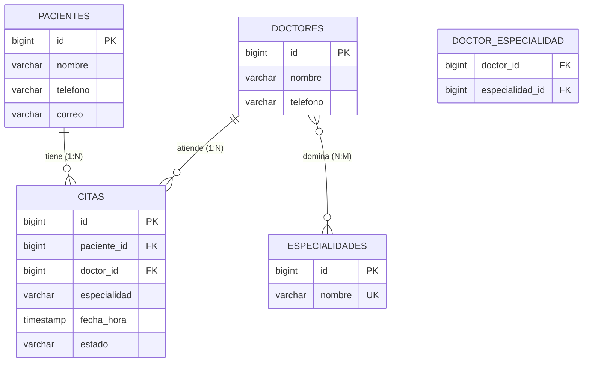

Relaciones mapeadas en JPA/Hibernate:
- `Paciente → Cita`: 1:N (`@OneToMany` / `@ManyToOne`)
- `Doctor → Cita`: 1:N (`@OneToMany` / `@ManyToOne`)
- `Doctor ↔ Especialidad`: N:M (`@ManyToMany` con `@JoinTable` → tabla `doctor_especialidad`)

El script completo está en [`database/schema.sql`](./database/schema.sql) e incluye datos de prueba precargados.

---

## Manual de Despliegue con Docker

### Pre-requisitos

- Docker Desktop instalado y en ejecución.
- Docker Compose v2+.

### Paso 1 — Clonar el repositorio

```bash
git clone https://github.com/MA20081/Proyecto-DAW-GT01.git
cd Proyecto-DAW-GT01
```

### Paso 2 — Levantar todo el sistema con un solo comando

```bash
docker-compose up --build
```

Este comando construye las imágenes y levanta los 3 servicios, esperando a que la base de datos esté lista (healthcheck) antes de arrancar el backend:

| Servicio | Imagen | Puerto host → contenedor |
|---|---|---|
| db (PostgreSQL) | `postgres:15-alpine` | `5433 → 5432` |
| backend (Spring Boot) | multietapa Maven → JRE Alpine | `8080 → 8080` |
| frontend (React + Nginx) | multietapa Node → Nginx Alpine | `80 → 80` |

### Paso 3 — Acceder a la aplicación

| Recurso | URL |
|---|---|
| Frontend (aplicación) | http://localhost |
| Swagger UI | http://localhost:8080/swagger-ui.html |
| API JSON directo | http://localhost:8080/api/citas |
| Especificación OpenAPI | http://localhost:8080/api-docs |

### Paso 4 — Detener el sistema

```bash
docker-compose down          # Detiene y elimina los contenedores
docker-compose down -v       # Además elimina el volumen de la base de datos
```

Nota: el puerto de la base de datos hacia el host es 5433 (no 5432), para evitar conflictos con instalaciones locales de PostgreSQL. Internamente, dentro de la red de Docker, sigue siendo el 5432 estándar.

---

## Tabla de Endpoints (API REST)

20 endpoints — CRUD completo para las 4 entidades.

### Citas — `/api/citas`

| Método | Ruta | Descripción | Código |
|---|---|---|---|
| GET | `/api/citas` | Listar todas las citas | 200 |
| GET | `/api/citas/{id}` | Obtener cita por ID | 200 |
| POST | `/api/citas` | Crear nueva cita | 201 |
| PUT | `/api/citas/{id}` | Actualizar cita | 200 |
| DELETE | `/api/citas/{id}` | Eliminar cita | 204 |

### Pacientes — `/api/pacientes`

| Método | Ruta | Descripción | Código |
|---|---|---|---|
| GET | `/api/pacientes` | Listar todos los pacientes | 200 |
| GET | `/api/pacientes/{id}` | Obtener paciente por ID | 200 |
| POST | `/api/pacientes` | Registrar paciente | 201 |
| PUT | `/api/pacientes/{id}` | Actualizar paciente | 200 |
| DELETE | `/api/pacientes/{id}` | Eliminar paciente | 204 |

### Doctores — `/api/doctores`

| Método | Ruta | Descripción | Código |
|---|---|---|---|
| GET | `/api/doctores` | Listar todos los doctores | 200 |
| GET | `/api/doctores/{id}` | Obtener doctor por ID | 200 |
| POST | `/api/doctores` | Registrar doctor | 201 |
| PUT | `/api/doctores/{id}` | Actualizar doctor | 200 |
| DELETE | `/api/doctores/{id}` | Eliminar doctor | 204 |

### Especialidades — `/api/especialidades`

| Método | Ruta | Descripción | Código |
|---|---|---|---|
| GET | `/api/especialidades` | Listar especialidades | 200 |
| GET | `/api/especialidades/{id}` | Obtener especialidad por ID | 200 |
| POST | `/api/especialidades` | Crear especialidad | 201 |
| PUT | `/api/especialidades/{id}` | Actualizar especialidad | 200 |
| DELETE | `/api/especialidades/{id}` | Eliminar especialidad | 204 |

---

## Evidencias de Funcionamiento

### Swagger UI

Documentación interactiva generada con SpringDoc OpenAPI:

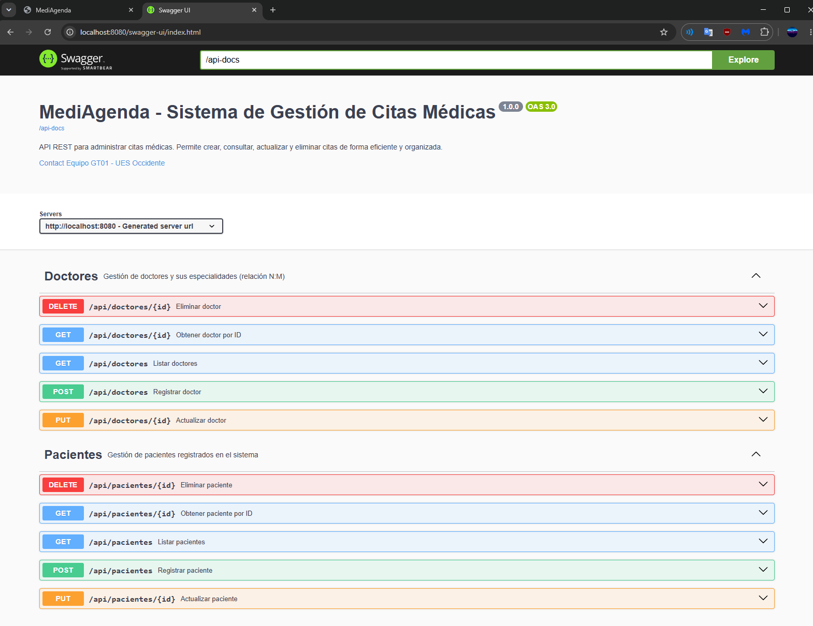

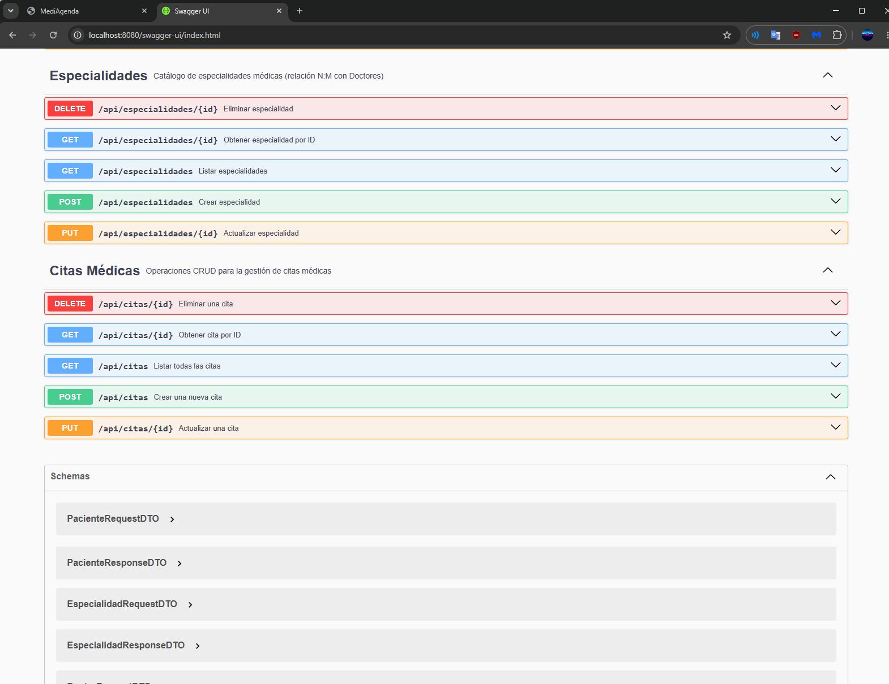

Prueba de POST con respuesta 201 Created:

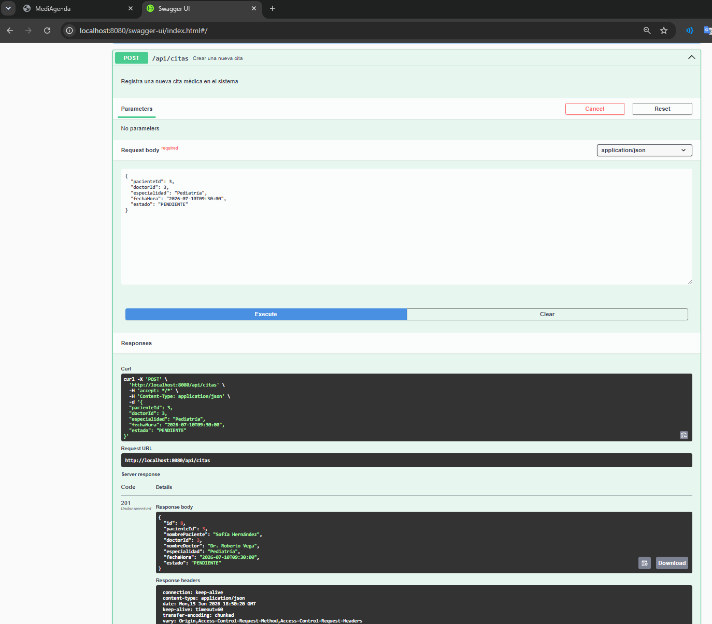

Prueba de GET con respuesta 200 OK:

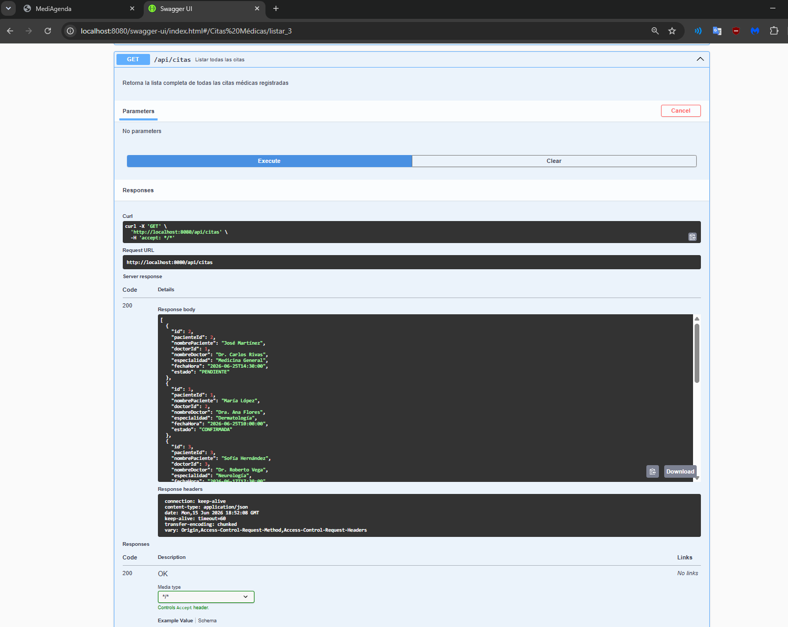

### Vistas del Frontend

Listado de citas con badges de estado (CONFIRMADA, PENDIENTE, CANCELADA):

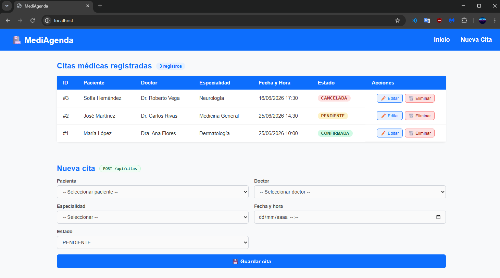

Formulario para crear una nueva cita, con selectores dinámicos cargados desde la API:

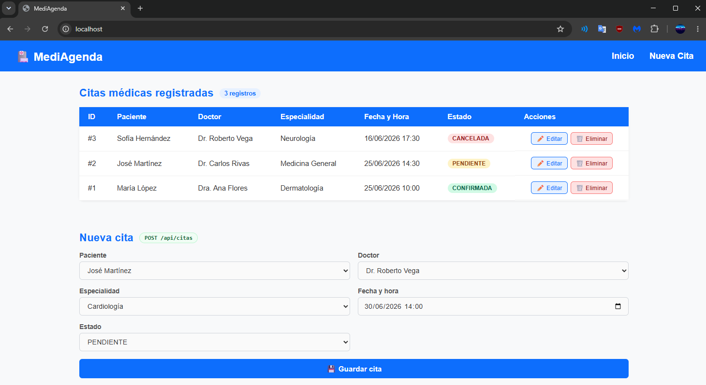

Resultado después de crear la cita (tabla actualizada + notificación):

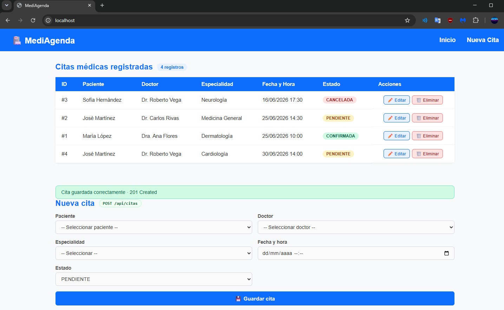

Modal de edición de cita (PUT):

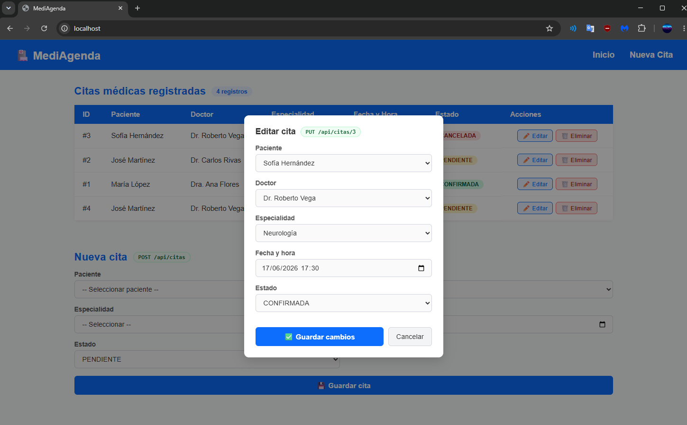

Confirmación antes de eliminar una cita (DELETE):

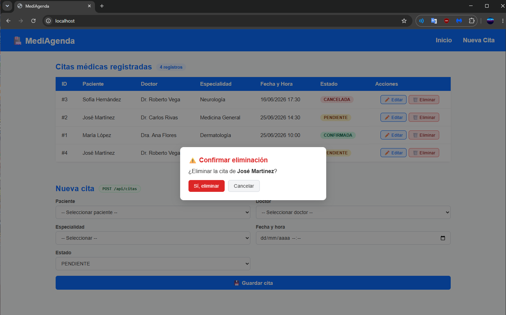

### Validación en Base de Datos

Consulta directa a PostgreSQL confirmando la persistencia de los datos:

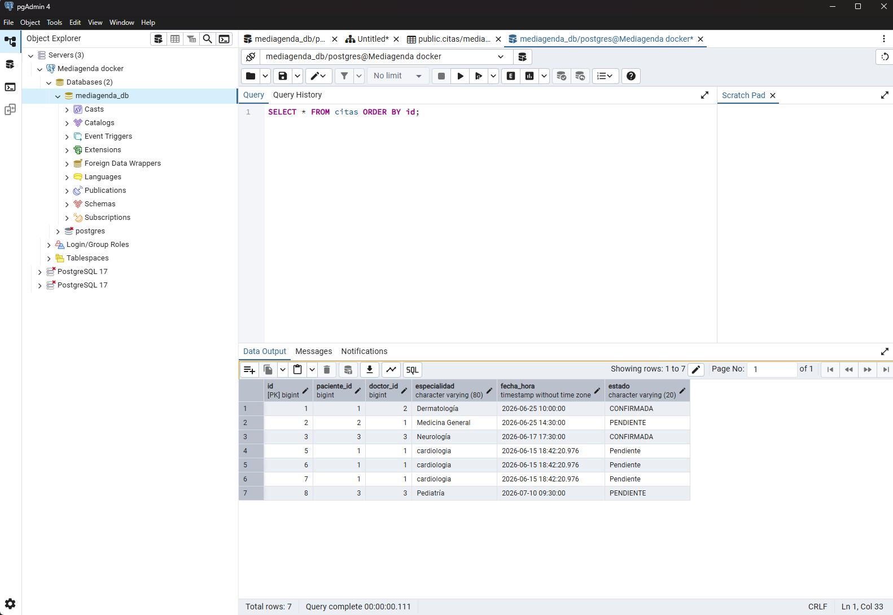

---

## Estructura del Repositorio

```
.
├── backend/                # Código fuente Spring Boot (N-Capas + DTOs)
│   └── mediagenda/
│       ├── src/main/java/com/mediagenda/
│       │   ├── config/         # SwaggerConfig, CorsConfig
│       │   ├── controller/     # Endpoints REST
│       │   ├── dto/            # Request / Response por entidad
│       │   ├── model/          # Entidades JPA
│       │   ├── repository/     # Repositorios JPA
│       │   └── service/        # Lógica de negocio + mapeo DTO-Entidad
│       ├── src/main/resources/ # application.properties, schema.sql
│       └── Dockerfile          # Multietapa Maven -> JRE Alpine
├── frontend/               # Código fuente React + Vite
│   ├── src/
│   │   ├── components/        # Navbar, TablaCitas, FormNuevaCita,
│   │   │                      #   ModalEditar, ModalEliminar, Toast
│   │   ├── services/api.js    # Cliente Axios centralizado
│   │   └── App.jsx            # Estado global (useState/useEffect)
│   ├── nginx.conf             # Proxy inverso /api/* -> backend
│   └── Dockerfile             # Multietapa Node -> Nginx Alpine
├── database/
│   └── schema.sql             # DDL + datos de prueba
├── docs/                      # Capturas de evidencia
├── docker-compose.yml         # Orquestación de los 3 servicios
└── README.md
```

---

## Notas Técnicas

- `ddl-auto=none`: Hibernate no modifica las tablas; el esquema lo gestiona `schema.sql` (control total del DDL).
- `spring.sql.init.mode=always` + secuencias explícitas compatibles con `@SequenceGenerator`.
- Healthcheck con `pg_isready`: el backend solo arranca cuando la BD está lista (`depends_on: service_healthy`).
- Dockerfiles multietapa: imágenes finales ligeras (JRE Alpine / Nginx Alpine).
- Nginx como proxy inverso: el frontend consume `/api/*` y Nginx lo redirige al backend, eliminando problemas de CORS en producción.
